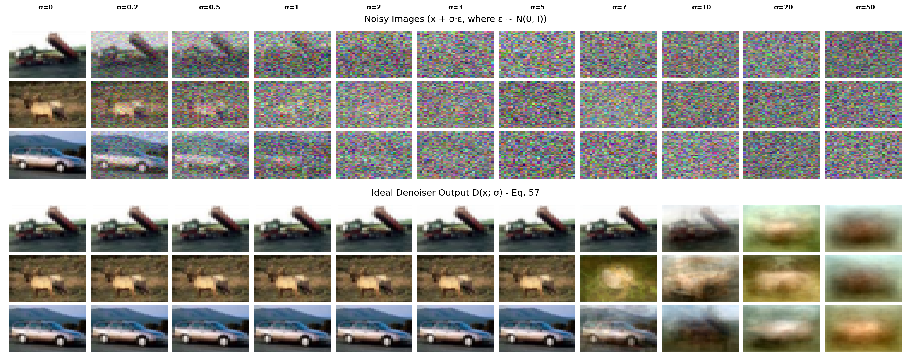
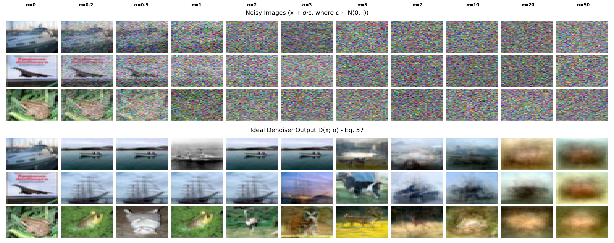

# Ideal Denoiser - Unofficial Implementation of EDM Equation 57

[](https://arxiv.org/abs/2206.00364)
[](LICENSE)

This repository provides a clean implementation of the **Ideal Denoiser** (Equation 57) from the paper:

> **Elucidating the Design Space of Diffusion-Based Generative Models**  
> Tero Karras, Miika Aittala, Timo Aila, Samuli Laine  
> NeurIPS 2022

## 📖 Overview

The **ideal denoiser** represents the theoretical optimal solution to the image denoising problem under additive Gaussian noise. It computes the exact **posterior mean** $\mathbb{E}[x' \mid x]$, where $x'$ is the clean image and $x$ is the noisy observation. This closed-form solution, given as Equation 57 in the EDM paper, serves as an upper bound for evaluating practical denoising algorithms.

### Key Contributions

This repository provides:

1. **Theoretical Foundation**: Implementation of Equation 57 (closed-form optimal denoiser) from the EDM paper
2. **Numerical Methods**: Our own implementation of stable computation using log-sum-exp techniques for extreme noise levels
3. **Empirical Analysis**: Visualization tools for comparing denoising performance across noise levels
4. **Mathematical Documentation**: Rigorous derivations connecting Bayesian inference, score matching, and denoising

### Equation 57: The Closed-Form Solution

Given a dataset $\{x_1, \ldots, x_N\}$ representing the empirical data distribution, the ideal denoiser is expressed as:

$$
D(x; \sigma) = \frac{\sum_{i=1}^{N} x_i \cdot \exp\left(-\frac{\|x - x_i\|^2}{2\sigma^2}\right)}{\sum_{i=1}^{N} \exp\left(-\frac{\|x - x_i\|^2}{2\sigma^2}\right)}
$$

This formula computes a **weighted kernel average** over the training distribution, where each weight $w_i \propto \mathcal{N}(x; x_i, \sigma^2 I)$ represents the likelihood that training image $x_i$ generated the noisy observation $x$ under Gaussian noise model $\mathcal{N}(0, \sigma^2 I)$.

**Important Note on Numerical Stability:** Direct computation of this formula can cause numerical **overflow** or **underflow** when $\sigma$ is small or distances are large. Therefore, it must be implemented using the **log-sum-exp trick** for numerical stability. By defining $\ell_i = -\frac{\|x - x_i\|^2}{2\sigma^2}$ and $\delta = \max_j \ell_j$, the numerically stable formula becomes:

$$
D(x; \sigma) = \frac{\sum_{i=1}^{N} x_i \cdot \exp\left(-\frac{\|x - x_i\|^2}{2\sigma^2} - \delta\right)}{\sum_{i=1}^{N} \exp\left(-\frac{\|x - x_i\|^2}{2\sigma^2} - \delta\right)}
$$

where subtracting $\delta$ ensures that all exponents ($\ell_i - \delta$) are non-positive ($\leq 0$), bounding the exponential values in $(0, 1]$ and preventing numerical overflow. This maintains mathematical equivalence while providing numerical stability. For detailed mathematical derivations and analysis, see **[MATHEMATICAL_BACKGROUND.md](MATHEMATICAL_BACKGROUND.md)**.

## 🚀 Quick Start

### Installation

```bash
# Navigate to the repository
cd ideal-denoising

# Install dependencies
pip install -r requirements.txt
```

### Reproduce EDM Paper Visualization (Figure 1)

Generate empirical demonstrations of the ideal denoiser across the noise spectrum using the CLI tool:

```bash
python run_ideal_denoiser.py --num-images 2 --sigma-list 0 0.2 0.5 1 2 3 5 7 10 20 50
```

This experiment:
1. Loads CIFAR-10 as the empirical approximation of $p_{\text{data}}$
2. Synthesizes noisy observations at noise levels $\sigma \in [0, 0.2, 0.5, 1, 2, 3, 5, 7, 10, 20, 50]$
3. Applies Equation 57 to compute optimal posterior means
4. Generates comparative visualizations

**Output Files:**
- Results are saved in `./results/` with timestamped filenames
- Separate files for training and test sets (e.g., `*_train.png` and `*_test.png`)

**Visualization Structure:**
- **Top row:** Noisy observations $x = x' + n$ at various $\sigma$
- **Bottom row:** Posterior means $D(x; \sigma) = \mathbb{E}[x' \mid x]$
- **Columns:** Progression from low to high noise regimes

This demonstrates the denoiser's behavior across different signal-to-noise ratios.

**Example Results:**

<div align="center">

**Training Set (In-distribution denoising):**



**Test Set (Out-of-sample denoising):**



</div>

### Run Ideal Denoiser with Custom Parameters

Use the CLI tool to run the ideal denoiser with configurable parameters:

```bash
# Basic usage with default parameters
python run_ideal_denoiser.py

# Custom number of images and noise levels
python run_ideal_denoiser.py --num-images 5 --sigma-list 0 1 2 5 10

# Use GPU and larger training set
python run_ideal_denoiser.py --device cuda --train-size 5000
```

**CLI Parameters:**

| Parameter | Default | Description |
|-----------|---------|-------------|
| `--data-root` | `./data` | Root directory for CIFAR-10 data |
| `--save-dir` | `./results` | Directory to save output images |
| `--num-images` | `3` | Number of images to denoise from each dataset |
| `--train-size` | `1000` | Number of training images for denoiser reference |
| `--sigma-list` | `0 0.2 0.5 1 2 3 5 7 10 20 50` | List of noise levels to test |
| `--denoise-sigma` | `None` | Fixed sigma for denoising (if not set, uses same as noising) |
| `--device` | auto-detect | Device to use (`cpu` or `cuda`) |
| `--seed` | `None` | Random seed for reproducibility (if not set, selection is non-deterministic) |

For comprehensive mathematical background, including detailed derivations, theoretical analysis, and implementation details, please refer to **[MATHEMATICAL_BACKGROUND.md](MATHEMATICAL_BACKGROUND.md)**.

## 🤝 Acknowledgments

### Concept and Formula

The ideal denoiser concept and formula (Equation 57) are from:
- **EDM Paper**: Karras et al., "Elucidating the Design Space of Diffusion-Based Generative Models", NeurIPS 2022
- **Paper**: https://arxiv.org/abs/2206.00364
- **Equation 57**: Appendix B.3 of the paper

### Implementation

This implementation is our own work. This repository provides a clean, well-documented implementation.

## 📖 Citation

If you use this code, please cite the original EDM paper:

```bibtex
@inproceedings{Karras2022edm,
  author    = {Tero Karras and Miika Aittala and Timo Aila and Samuli Laine},
  title     = {Elucidating the Design Space of Diffusion-Based Generative Models},
  booktitle = {Proc. NeurIPS},
  year      = {2022}
}
```

## 📄 License

This project is provided freely for educational and research purposes.

**Attribution:**
- The ideal denoiser concept and formula (Equation 57) are from the EDM paper by Karras et al. (NeurIPS 2022)
- This implementation is our own work and is provided without license restrictions

## 🐛 Issues & Contributions

If you find any issues or have suggestions for improvements, please feel free to open an issue or submit a pull request.

## 📁 Project Structure

```
ideal-denoising/
├── ideal_denoiser.py           # Core implementation (Equation 57)
├── run_ideal_denoiser.py       # CLI tool to run denoiser with custom parameters
├── MATHEMATICAL_BACKGROUND.md  # Mathematical theory and derivations
├── README.md                   # This file
├── requirements.txt            # Dependencies
│
├── utils/                      # Utility modules
│   ├── __init__.py
│   ├── core.py                 # Core utilities (noise, data loading, normalization)
│   ├── processing.py           # Image processing pipelines
│   └── visualization.py        # Plotting and visualization
│
├── docs/                       # Documentation images
│   ├── figure1_combined_train.png
│   └── figure1_combined_test.png
│
├── data/                       # Dataset storage (auto-downloaded)
└── results/                    # Output directory for denoiser run results
```

---

**Note:** This repository focuses exclusively on the ideal denoiser (Equation 57). For the full EDM implementation including neural network-based denoisers, please refer to the [official EDM repository](https://github.com/NVlabs/edm).
